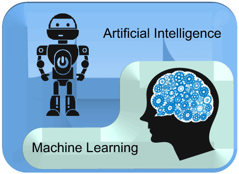
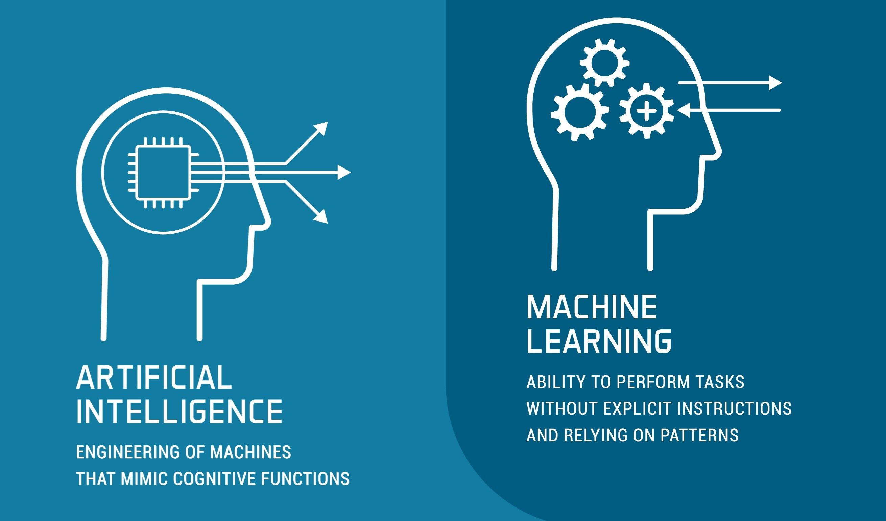
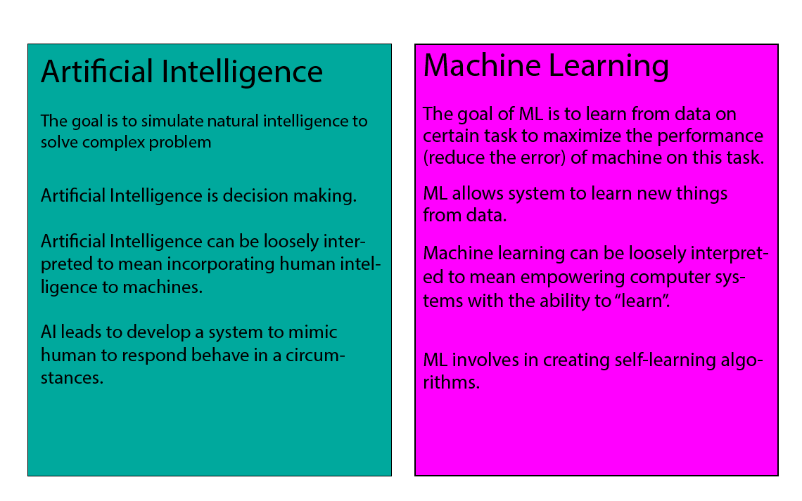

# WHAT IS AL-ML?

AI-ML—short for artificial intelligence (AI) and machine learning (ML)—represents an important evolution in computer science and data processing that is quickly transforming a vast array of industries.

As businesses and other organizations undergo digital transformation, they’re faced with a growing tsunami of data that is at once incredibly valuable and increasingly burdensome to collect, process and analyze. New tools and methodologies are needed to manage the vast quantity of data being collected, to mine it for insights and to act on those insights when they’re discovered.

## What is Artificial Intelligence?

Artificial intelligence (AI) generally refers to processes and algorithms that are able to simulate human intelligence, including mimicking cognitive functions such as perception, learning and problem solving. Machine learning and deep learning (DL) are subsets of AI.

Driving the AI revolution is generative AI, which is built on foundation models. Foundation models are programmed to have a baseline comprehension of how to communicate and identify patterns–this baseline comprehension can then be further modified, or fine tuned, to perform domain specific tasks for just about any industry. 

Specific practical applications of AI include modern web search engines, personal assistant programs that understand spoken language, self-driving vehicles and recommendation engines, such as those used by Spotify and Netflix.

There are four levels or types of AI—two of which we have achieved, and two which remain theoretical at this stage.

**4 types of AI**
In order from simplest to most advanced, the four types of AI include **reactive machines, limited memory, theory of mind and self-awareness**.

**1.Reactive machines** are able to perform basic operations based on some form of input. At this level of AI, no “learning” happens—the system is trained to do a particular task or set of tasks and never deviates from that. These are purely reactive machines that do not store inputs, have any ability to function outside of a particular context, or have the ability to evolve over time.

Examples of reactive machines include most recommendation engines, IBM’s Deep Blue chess AI, and Google’s AlphaGo AI (arguably the best Go player in the world).

**2.Limited memory** AI systems are able to store incoming data and data about any actions or decisions it makes, and then analyze that stored data in order to improve over time. This is where “machine learning” really begins, as limited memory is required in order for learning to happen.

Since limited memory AIs are able to improve over time, these are the most advanced AIs we have developed to date. Examples include self-driving vehicles, virtual voice assistants and chatbots. 

**3.Theory of mind** is the first of the two more advanced and (currently) theoretical types of AI that we haven’t yet achieved. At this level, AIs would begin to understand human thoughts and emotions, and start to interact with us in a meaningful way. Here, the relationship between human and AI becomes reciprocal, rather than the simple one-way relationship humans have with various less advanced AIs now.

The “theory of mind” terminology comes from psychology, and in this case refers to an AI understanding that humans have thoughts and emotions which then, in turn, affect the AI’s behavior.

**4.Self-awareness** is considered the ultimate goal for many AI developers, wherein AIs have human-level consciousness, aware of themselves as beings in the world with similar desires and emotions as humans. As yet, self-aware AIs are purely the stuff of science fiction.

## What is machine learning?

Machine learning (ML) is a subset of AI that falls within the “limited memory” category in which the AI (machine) is able to learn and develop over time.

There are a variety of different machine learning algorithms, with the three primary types being **supervised learning, unsupervised learning and reinforcement learning**. 

3 types of machine learning algorithms:

As with the different types of AI, these different types of machine learning cover a range of complexity. And while there are several other types of machine learning algorithms, most are a combination of—or based on—these primary three.

**1.Supervised learning** is the simplest of these, and, like it says on the box, is when an AI is actively supervised throughout the learning process. Researchers or data scientists will provide the machine with a quantity of data to process and learn from, as well as some example results of what that data should produce (more formally referred to as inputs and desired outputs).

The result of supervised learning is an agent that can predict results based on new input data. The machine may continue to refine its learning by storing and continually re-analyzing these predictions, improving its accuracy over time.

Supervised machine learning applications include image-recognition, media recommendation systems, predictive analytics and spam detection.

**2.Unsupervised learning** involves no help from humans during the learning process. The agent is given a quantity of data to analyze, and independently identifies patterns in that data. This type of analysis can be extremely helpful, because machines can recognize more and different patterns in any given set of data than humans. Like supervised machine learning, unsupervised ML can learn and improve over time.

Unsupervised machine learning applications include things like determining customer segments in marketing data, medical imaging, and anomaly detection.

**3.Reinforcement learning** is the most complex of these three algorithms in that there is no data set provided to train the machine. Instead, the agent learns by interacting with the environment in which it is placed. It receives positive or negative rewards based on the actions it takes, and improves over time by refining its responses to maximize positive rewards.

Some applications of reinforcement learning include self-improving industrial robots, automated stock trading, advanced recommendation engines and bid optimization for maximizing ad spend.

## Are AI and machine learning the same?

While AI and machine learning are very closely connected, they’re not the same. Machine learning is considered a subset of AI.

## How are AI and machine learning connected?

The simplest way to understand how AI and ML relate to each other is: AI is the broader concept of enabling a machine or system to sense, reason, act, or adapt like a human. ML is an application of AI that allows machines to extract knowledge from data and learn from it autonomously.

## How AI and machine learning work together?

When you’re looking into the difference between artificial intelligence and machine learning, it’s helpful to see how they interact through their close connection. This is how AI and machine learning work together:

  **Step 1** :An AI system is built using machine learning and other techniques.

   **Step 2** :Machine learning models are created by studying patterns in the data.

   **Step 3** :Data scientists optimize the machine learning models based on patterns in the data.

   **Step 4** :The process repeats and is refined until the models’ accuracy is high enough for the tasks that need to be done.

## Capabilities of AI and machine learning

Companies in almost every industry are discovering new opportunities through the connection between AI and machine learning. These are just a few capabilities that have become valuable in helping companies transform their processes and products:

**1.Predictive analytics**:
This capability helps companies predict trends and behavioral patterns by discovering cause-and-effect relationships in data.

**2.Recommendation engines**:
With recommendation engines, companies use data analysis to recommend products that someone might be interested in.

**3.Speech recognition and natural language understanding**:
Speech recognition enables a computer system to identify words in spoken language, and natural language understanding recognizes meaning in written or spoken language.

**4.Image and video processing**:
These capabilities make it possible to recognize faces, objects, and actions in images and videos, and implement functionalities such as visual search.

**5.Sentiment analysis**:
A computer system uses sentiment analysis to identify and categorize positive, neutral, and negative attitudes that are expressed in text.

## Benefits of AI and machine learning

The connection between artificial intelligence and machine learning offers powerful benefits for companies in almost every industry—with new possibilities emerging constantly. These are just a few of the top benefits that companies have already seen:

**1.More sources of data input**:
AI and machine learning enable companies to discover valuable insights in a wider range of structured and unstructured data sources.

**2.Better, faster decision-making**
Companies use machine learning to improve data integrity and use AI to reduce human error—a combination that leads to better decisions based on better data.

**3.Increased operational efficiency**
With AI and machine learning, companies become more efficient through process automation, which reduces costs and frees up time and resources for other priorities.

## Applications of AI and machine learning
Companies in several industries are building applications that take advantage of the connection between artificial intelligence and machine learning. These are just a few ways that AI and machine learning are helping companies transform their processes and products:

**1.Retail**:
Retailers use AI and machine learning to optimize their inventories, build recommendation engines, and enhance the customer experience with visual search.

**2.Healthcare**:
Health organizations put AI and machine learning to use in applications such as image processing for improved cancer detection and predictive analytics for genomics research.

**3.Banking and finance**:
In financial contexts, AI and machine learning are valuable tools for purposes such as detecting fraud, predicting risk, and providing more proactive financial advice.

**4.Sales and marketing**:
Sales and marketing teams use AI and machine learning for personalized offers, campaign optimization, sales forecasting, sentiment analysis, and prediction of customer churn.

**5.Cybersecurity**:
AI and machine learning are powerful weapons for cybersecurity, helping organizations protect themselves and their customers by detecting anomalies.

**6.Customer service**:
Companies in a wide range of industries use chatbots and cognitive search to answer questions, gauge customer intent, and provide virtual assistance.

**7.Transportation**:
AI and machine learning are valuable in transportation applications, where they help companies improve the efficiency of their routes and use predictive analytics for purposes such as traffic forecasting.

**8.Manufacturing**:
Manufacturing companies use AI and machine learning for predictive maintenance and to make their operations more efficient than ever.
