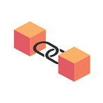
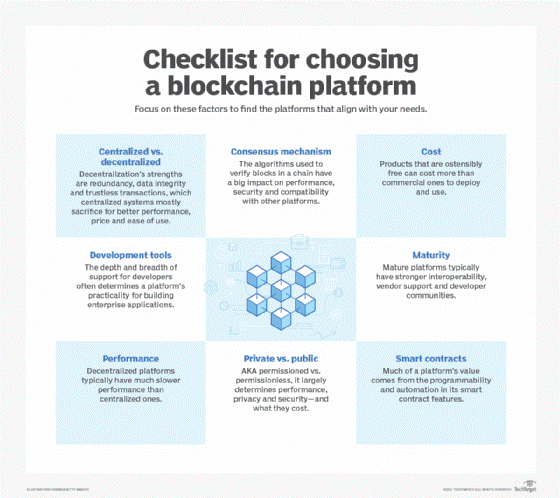

# Unraveling Blockchain and Web3

 

## 1. Introduction
Blockchain is an innovative technology known as a distributed ledger system. It secures records through transparency and tamper resistance using cryptographic principles. Web3 signifies the next era of the internet, emphasizing decentralization, interoperability, and user empowerment. It utilizes blockchain and decentralized technologies to create a more open and inclusive internet.

 

## 2. Blockchain and its Components

### 2.1 Basics of Blockchain
Blockchain's foundation lies in decentralization, immutability, and transparency, ensuring the integrity of data. Nodes in the network achieve consensus on transactions, eliminating the need for central authority.

### 2.2 Decentralization
It is a core principle of blockchain systems. Decentralization distributes control across a network, minimizing the risk of a single point of failure.

### 2.3 Blockchain Platforms
- Ethereum
- Binance Smart Chain
- Hyperledger Fabric
- IBM Blockchain
- Solana
- Tezos

 

## 3. Web3 and its Components

### 3.1 Introduction to Web3
Web3 envisions a decentralized internet where users have more control over their data and interactions, leveraging blockchain, decentralized protocols, and cryptographic technologies.

### 3.2 Decentralized Applications (DApps)
DApps operate on blockchain platforms, offering transparency, security, and user control. They operate without central authority, often utilizing smart contracts.

### 3.3 Inter-operability
Interoperability allows different blockchains to communicate and share information. Standards like the Interledger Protocol (ILP) enable seamless transactions between diverse blockchains.

### 3.4 Cryptographic Identity
Web3 focuses on cryptographic identity solutions, providing users with secure and verifiable digital identities, reducing reliance on centralized entities.

### 3.5 Tokenization
Tokenization represents real-world assets on the blockchain as digital tokens, facilitating fractional ownership, liquidity, and programmability.

 

## 4. Challenges

### Scalability Issues in Blockchain
Scalability challenges in blockchain systems include concerns about transaction throughput and confirmation times.

 

## 5. Benefits and Uses of Blockchain and Web3

### 5.1 Privacy Concerns in Blockchain
Blockchain transparency raises privacy concerns. Privacy-focused technologies like zero-knowledge proofs aim to address these issues.

### 5.2 Security Measures in Web3

Security measures include cryptographic techniques, secure development practices, and consensus mechanisms to protect against attacks and vulnerabilities.

### 5.3 Supply Chain Management
Blockchain enhances supply chain transparency and traceability, recording transactions in a tamper-resistant manner.

### 5.4 Identity Management
Decentralized identity solutions give users control over digital identities, reducing the risk of identity theft.

### 5.5 Voting Systems
Blockchain-based voting systems offer transparency, security, and accessibility, addressing concerns about election fraud.

### 5.6 Gaming and NFTs
Blockchain enables the creation of non-fungible tokens (NFTs) for digital assets, revolutionizing the gaming industry with true ownership of in-game items.

 

## 6. Future Scope

### 6.1 Integration of AI and Blockchain
The integration of artificial intelligence and blockchain is expected to bring innovative solutions, enhancing automation and decision-making processes.

### 6.2 Web3 and the Internet of Things (IoT)
Combining Web3 and IoT is anticipated to create a more interconnected and secure ecosystem, enabling devices to interact autonomously and securely.

 

## 7. Conclusion

This document provided an in-depth exploration of blockchain technology, Web3, and their various components. The future of blockchain and Web3 holds promise for transformative advancements in various industries. Continued research, collaboration, and regulatory developments will play a crucial role in shaping this evolving landscape.
