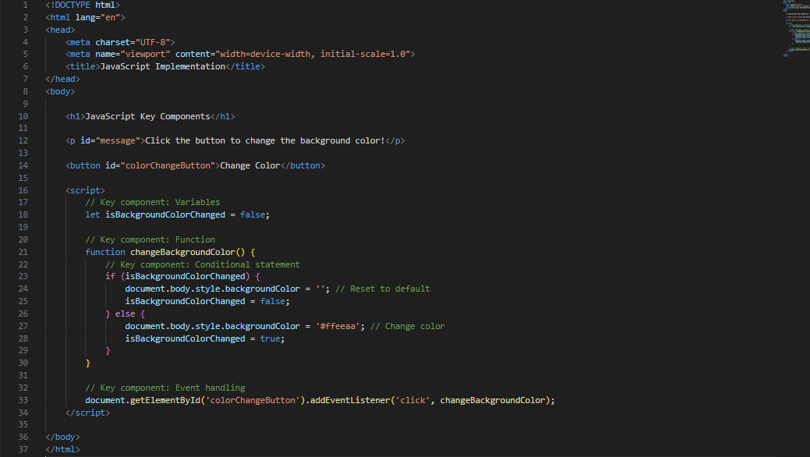

# JavaScript – A Versatile Language

<br>

## 1. Introduction
JavaScript is a versatile programming language primarily used for building dynamic web applications. It was initially created to enhance the interactivity of web pages by providing a way to manipulate the Document Object Model (DOM) in browsers. Over time, JavaScript has evolved into a powerful and widely-used language that can run not only in browsers but also on servers and other environments.

<br>

## 2. Key Features

### 2.1 Interpreted Language
JavaScript is an interpreted language, executed directly by the browser or runtime environment.

### 2.2 Dynamic Typing
Variables are not explicitly typed, allowing for flexibility in assigning different data types.

### 2.3 Object-Oriented
Supports object-oriented programming paradigms with prototypes and inheritance.

### 2.4 Event-Driven
Enables asynchronous programming through events and callbacks.

### 2.5 Cross-platform
Works across different browsers and operating systems.

<br>

## 3. Applications

### 3.1 Web Development
- **Front-End Development:** JavaScript is primarily known for enhancing the interactivity and dynamic behavior of websites. It is used in conjunction with HTML and CSS to create engaging user interfaces.

### 3.2 Frameworks and Libraries
- Popular front-end frameworks and libraries like React, Angular, and Vue.js are built using JavaScript, simplifying the development of complex web applications.

### 3.3 Server-Side Development
- **Node.js:** JavaScript can be used on the server side with Node.js, allowing developers to build scalable and high-performance server applications. It is commonly used for building APIs and server-side logic.

### 3.4 Mobile App Development
- **React Native:** JavaScript is used in frameworks like React Native for developing cross-platform mobile applications. Code written in JavaScript can be used to create native mobile apps for both iOS and Android platforms.

### 3.5 Game Development
- Game Engines: JavaScript is used in game development, especially with game engines like Phaser and Babylon.js, to create browser-based games and interactive multimedia experiences.

### 3.6 Desktop Application Development
- **Electron:** JavaScript, along with HTML and CSS, can be used to build desktop applications. Electron is a framework that allows developers to create cross-platform desktop apps using web technologies.

### 3.7 Browser Extensions
- JavaScript is commonly used for developing browser extensions, adding functionality and customization to popular web browsers like Chrome, Firefox, and Edge.

### 3.8 Automation and Scripting
- JavaScript is used for scripting and automation tasks, especially in web-related scenarios. Tools like Puppeteer use JavaScript for headless browser automation.

### 3.9 Data Visualization
- Libraries like D3.js leverage JavaScript to create interactive and dynamic data visualizations on the web. It is widely used for displaying charts, graphs, and maps.

### 3.10 Web Servers and APIs
- JavaScript is used to create server-side logic, handle HTTP requests, and build RESTful APIs. Express.js is a popular framework for building web servers with Node.js.

### 3.11 Real-Time Applications
- JavaScript is well-suited for real-time applications such as chat applications, collaborative editing tools, and live-streaming platforms.

### 3.12 IoT (Internet of Things)
- JavaScript can be used in IoT development, particularly with platforms like Johnny-Five, allowing developers to program and control IoT devices using familiar web development skills.

### 3.13 Machine Learning and AI
- With the advent of libraries like TensorFlow.js, JavaScript is increasingly used for machine learning and artificial intelligence tasks directly in the browser.

### 3.14 Cloud Computing
- JavaScript is used in cloud computing environments, and frameworks like Serverless Framework enable developers to deploy serverless functions in the cloud using JavaScript.

<br>

## 4. Key Components

### 4.1 Variables
### 4.2 Data Types
- e.g., numbers, strings, booleans, objects, arrays, functions, and more
  ```javascript
  let name = "John";
  let age = 25;
  let isStudent = true;
  let fruits = ["apple", "banana", "orange"];

### 4.3 Operators
JavaScript includes arithmetic, comparison, logical, and assignment operators to perform operations on variables and values.

### 4.4 Control Flow
Control flow structures such as if, else, switch, while, and for are used to control the flow of program execution.

### 4.5 Functions
Functions allow developers to define reusable blocks of code. They can take parameters and return values.

### 4.6 Objects
Objects are used to group related data and functions together. They consist of key-value pairs.

### 4.7 Arrays
Arrays are ordered lists of values. They are used to store collections of data.

### 4.8 Prototypes and Inheritance
JavaScript uses prototypes for object-oriented programming. Objects can inherit properties and methods from other objects.

### 4.9 Closures
Closures allow functions to access variables from their outer scope, even after the outer function has finished execution.

<br>

## 5. Why is it a versatile language?

### 5.1 Cross-platform Compatibility
JavaScript is executed on the client side, allowing it to run on virtually any device with a web browser. This cross-platform compatibility makes it a versatile choice for developing applications that can reach a broad audience.

### 5.2 Multi-paradigm Programming
JavaScript supports multiple programming paradigms, including procedural, object-oriented, and functional programming. Developers can choose the paradigm that best fits their project requirements, making JavaScript adaptable to different coding styles.

### 5.3 Interactivity on the Web
JavaScript is the primary language for enhancing interactivity on the web. It allows developers to manipulate the DOM, handle user input, and create dynamic content, leading to engaging and interactive user experiences.

### 5.4 Server-Side Development with Node.js
With the advent of Node.js, JavaScript is no longer limited to the client side. Developers can use JavaScript on the server side to build scalable and efficient server applications. This makes it a full-stack language, enabling end-to-end development with a single language.

### 5.5 Automation and Scripting
JavaScript is used for scripting and automation tasks, especially in web-related scenarios. Tools like Puppeteer leverage JavaScript for headless browser automation, testing, and data scraping.

### 5.6 Extensibility in Browsers
JavaScript can be used to extend the functionality of web browsers through browser extensions. This allows developers to customize and enhance the browsing experience using JavaScript.

<br>

## 6. Implementation



<br>

## 7. Conclusion
JavaScript, with its dynamic nature and extensive ecosystem, empowers developers to create interactive and feature-rich web applications. Embracing tools and best practices is essential for efficient development, debugging, and maintaining high-quality code.

In conclusion, a combination of robust development tools, adherence to coding best practices, and a commitment to continuous improvement ensures that JavaScript projects are not only functional but also scalable, maintainable, and resilient in the face of evolving requirements and challenges.
