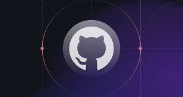
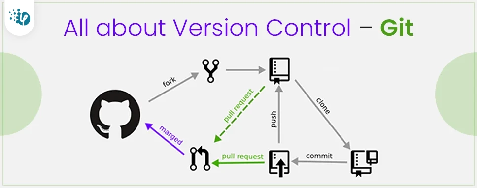

# Git Documentation

## Introduction


Git is a distributed version control system designed to manage and track changes in source code during software development. It allows multiple developers to collaborate on a project simultaneously, tracking changes and facilitating efficient collaboration. Git is widely used in the software development industry due to its flexibility, speed, and robust branching and merging capabilities.

## Installing Git


### Windows

1. Download the Git installer for Windows from the official website: [Git for Windows](https://gitforwindows.org/).
2. Run the downloaded installer and follow the on-screen instructions.
3. Choose the default settings or customize the installation according to your preferences.


## Configuring Git

Once Git is installed, configure it with your name and email address:

```bash
git config --global user.name "Your Name"
git config --global user.email "your.email@example.com"
```

This information is used to identify your commits.

## Using Git - Basic Commands

### 1. Initializing a Repository

To start tracking changes in a project, navigate to the project directory and run:

```bash
git init
```

### 2. Cloning a Repository

To clone an existing repository, use the following command:

```bash
git clone <repository_url>
```

### 3. Staging Changes

Before committing changes, you need to stage them. Use the following command to stage changes:

```bash
git add <file1> <file2> ...
```

### 4. Committing Changes

Committing staged changes to the repository:

```bash
git commit -m "Commit message"
```

### 5. Checking Status

Check the status of your working directory:

```bash
git status
```

### 6. Viewing Commit History

View the commit history of the repository:

```bash
git log
```

## Branching Strategies

### 1. Creating a Branch

Create a new branch for developing a new feature or fixing a bug:

```bash
git branch <branch_name>
git checkout <branch_name>
```

Alternatively, you can combine these commands using:

```bash
git checkout -b <branch_name>
```

### 2. Merging Branches

Merge changes from one branch into another:

```bash
git checkout <target_branch>
git merge <source_branch>
```

### 3. Resolving Conflicts

If there are conflicts during a merge, resolve them manually, then:

```bash
git add <conflicted_file>
git merge --continue
```

### 4. Deleting a Branch

Once a branch is no longer needed, delete it:

```bash
git branch -d <branch_name>
```

## VERSION CONTROL

**Version control** is a system that records changes to a file or set of files over time so that you can recall specific versions later. It allows multiple contributors to work on a project simultaneously and track modifications to the source code, documents, or any set of files. The primary goals of version control are to manage changes systematically, facilitate collaboration among team members, and provide a history of modifications for future reference.

There are two main types of version control systems:

1. **Centralized Version Control Systems (CVCS):** In a CVCS, a central server stores the complete history of the project, and clients interact with this central repository to check out the latest version and commit changes. 

2. **Distributed Version Control Systems (DVCS):** In a DVCS, each user has a complete copy of the repository, including its full history. Users can work independently and commit changes to their local repository. 

Key features of version control systems include:

- **Change Tracking:** Version control systems keep track of every change made to files, allowing users to view the history of modifications.

- **Branching and Merging:** Users can create branches to work on new features or bug fixes independently. Branches can later be merged to incorporate changes into the main codebase.

- **Collaboration:** Multiple developers can work on a project simultaneously, and the version control system helps manage conflicts and integrate changes.

- **Revert to Previous Versions:** Users can revert to a previous state of the project, allowing for easy recovery from mistakes or bugs.

- **Annotation and Metadata:** Version control systems provide information about who made a particular change, when the change was made, and why the change was made.