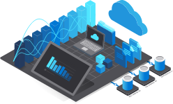
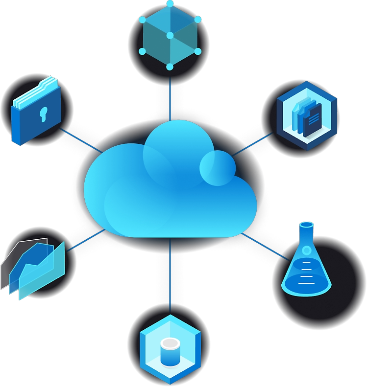

# INTRODUCTION TO CLOUD COMPUTING 

## DEFINITION:
Cloud computing is the on-demand availability of computer system resources, especially data storage (cloud storage) and computing power, without direct active management by the user. Large clouds often have functions distributed over multiple locations, each of which is a data center. Cloud computing relies on sharing of resources to achieve coherence and typically uses a pay-as-you-go model, which can help in reducing capital expenses but may also lead to unexpected operating expenses for users.

The United States National Institute of Standards and Technology's definition of cloud computing identifies "five essential characteristics":

**1.On-demand self-service** A consumer can unilaterally provision computing capabilities, such as server time and network storage, as needed automatically without requiring human interaction with each service provider.

**2.Broad network access** Capabilities are available over the network and accessed through standard mechanisms that promote use by heterogeneous thin or thick client platforms (e.g., mobile phones, tablets, laptops, and workstations).

**3.Resource pooling** The provider's computing resources are pooled to serve multiple consumers using a multi-tenant model, with different physical and virtual resources dynamically assigned and reassigned according to consumer demand. 

**4.Rapid elasticity** Capabilities can be elastically provisioned and released, in some cases automatically, to scale rapidly outward and inward commensurate with demand. To the consumer, the capabilities available for provisioning often appear unlimited and can be appropriated in any quantity at any time.

**5.Measured service** Cloud systems automatically control and optimize resource use by leveraging a metering capability at some level of abstraction appropriate to the type of service (e.g., storage, processing, bandwidth, and active user accounts). Resource usage can be monitored, controlled, and reported, providing transparency for both the provider and consumer of the utilized service.

## TOP BENEFITS OF CLOUD COMPUTING:
Cloud computing is a big shift from the traditional way businesses think about IT resources. Here are seven common reasons organizations are turning to cloud computing services:

**Cost:**
Moving to the cloud helps companies optimize IT costs. This is because cloud computing eliminates the capital expense of buying hardware and software and setting up and running onsite datacenters—the racks of servers, the round-the-clock electricity for power and cooling, and the IT experts for managing the infrastructure. It adds up fast.

**Speed:**
Most cloud computing services are provided self service and on demand, so even vast amounts of computing resources can be provisioned in minutes, typically with just a few mouse clicks, giving businesses a lot of flexibility and taking the pressure off capacity planning.

**Global Scale:**
The benefits of cloud computing services include the ability to scale elastically. In cloud speak, that means delivering the right amount of IT resources—for example, more or less computing power, storage, bandwidth—right when they’re needed, and from the right geographic location.

**Productivity:**
Onsite datacenters typically require a lot of “racking and stacking”—hardware setup, software patching, and other time-consuming IT management chores. Cloud computing removes the need for many of these tasks, so IT teams can spend time on achieving more important business goals.

**Productivity:**
The biggest cloud computing services run on a worldwide network of secure datacenters, which are regularly upgraded to the latest generation of fast and efficient computing hardware. This offers several benefits over a single corporate datacenter, including reduced network latency for applications and greater economies of scale.

**Reliability:**
Cloud computing makes data backup, disaster recovery, and business continuity easier and less expensive because data can be mirrored at multiple redundant sites on the cloud provider’s network.

**Security:**
Many cloud providers offer a broad set of policies, technologies, and controls that strengthen your security posture overall, helping protect your data, apps, and infrastructure from potential threats.

## TOP DEMERITS OF CLOUD COMPUTING:
Despite the clear upsides to relying on cloud services, cloud computing has its own challenges for IT professionals:

**Cloud security.** Security is often considered the greatest challenge organizations face with cloud computing. When relying on the cloud, organizations risk data breaches, hacking of APIs and interfaces, compromised credentials and authentication issues. Furthermore, there's a lack of transparency regarding how and where sensitive information entrusted to the cloud provider is handled. Security demands careful attention to cloud configurations and business policy and practice.

**Unpredictable costs.** Pay-as-you-go subscription plans for cloud use, along with scaling resources to accommodate fluctuating workload demands, can make it difficult to define and predict final costs. Cloud costs are also frequently interdependent, with one cloud service often using one or more other cloud services -- all of which appear in the recurring monthly bill. This can create additional unplanned cloud costs.

**Lack of expertise.** With cloud-supporting technologies rapidly advancing, organizations are struggling to keep up with the growing demand for tools and employees with the proper skills and knowledge needed to architect, deploy and manage workloads and data in a cloud.

**IT governance difficulties.** The emphasis on do-it-yourself in cloud computing can make IT governance difficult, as there's no control over provisioning, deprovisioning and management of infrastructure operations. This can make it challenging for organizations to properly manage risks and security, IT compliance and data quality.

**Compliance with industry laws.** When transferring data from on-premises local storage into cloud storage, it can be difficult to manage compliance with industry regulations through a third party. It's important to know where data and workloads are actually hosted to maintain regulatory compliance and proper business governance.

**Management of multiple clouds.** Every cloud is different, so multi-cloud deployments can disjoint efforts to address more general cloud computing challenges.

**Cloud performance.** Performance -- such as latency -- is largely beyond the control of the organization contracting cloud services with a provider. Network and provider outages can interfere with productivity and disrupt business processes if organizations aren't prepared with contingency plans.

**Cloud migration.** The process of moving applications and other data to the cloud often causes complications. Migration projects frequently take longer than anticipated and go over budget. The issue of workload and data repatriation -- moving from the cloud back to a local data center -- is often overlooked until unforeseen costs or performance problems arise.

**Vendor lock-in.** Often, switching between cloud providers can cause significant issues. This includes technical incompatibilities, legal and regulatory limitations and substantial costs incurred from sizable data migrations. 

## TYPES OF CLOUD COMPUTING:

**1.Public cloud:**
Public clouds are owned and operated by third-party cloud service providers, which deliver computing resources like servers and storage over the internet. Microsoft Azure is an example of a public cloud. With a public cloud, all hardware, software, and other supporting infrastructure is owned and managed by the cloud provider. You access these services and manage your account using a web browser. 

**2.Private cloud:**
A private cloud refers to cloud computing resources used exclusively by a single business or organization. A private cloud can be physically located on the company’s onsite datacenter. Some companies also pay third-party service providers to host their private cloud. A private cloud is one in which the services and infrastructure are maintained on a private network.

**3.Hybrid cloud:**
Hybrid clouds combine public and private clouds, bound together by technology that allows data and applications to be shared between them. By allowing data and applications to move between private and public clouds, a hybrid cloud gives your business greater flexibility and more deployment options and helps optimize your existing infrastructure, security, and compliance. 

## TYPES OF CLOUD SERVICES: IaaS, PaaS, FaaS(serverless), and SaaS
Most cloud computing services fall into four broad categories: infrastructure as a service (IaaS), platform as a service (PaaS), serverless, and software as a service (SaaS). These are sometimes called the cloud computing "stack" because they build on top of one another. Knowing what they are and how they’re different makes it easier to accomplish your business goals.

**1.IaaS:**
The most basic category of cloud computing services. With infrastructure as a service (IaaS), you rent IT infrastructure—servers and virtual machines (VMs), storage, networks, operating systems—from a cloud provider on a pay-as-you-go basis.

**2.PaaS:**
Platform as a service (PaaS) refers to cloud computing services that supply an on-demand environment for developing, testing, delivering, and managing software applications. PaaS is designed to make it easier for developers to quickly create web or mobile apps, without worrying about setting up or managing the underlying infrastructure of servers, storage, network, and databases needed for development.

**3.SaaS:**
Software as a service (SaaS) is a method for delivering software applications over the internet, on demand and typically on a subscription basis. With SaaS, cloud providers host and manage the software application and underlying infrastructure, and handle any maintenance, like software upgrades and security patching. Users connect to the application over the internet, usually with a web browser on their phone, tablet, or PC.

**4.FaaS(OR Serverless computing):**
Overlapping with PaaS, serverless computing focuses on building app functionality without spending time continually managing the servers and infrastructure required to do so. The cloud provider handles the setup, capacity planning, and server management for you. Serverless architectures are highly scalable and event-driven, only using resources when a specific function or trigger occurs.

## USES OF CLOUD COMPUTING:
You’re probably using cloud computing right now, even if you don’t realize it. If you use an online service to send email, edit documents, watch movies or TV, listen to music, play games, or store pictures and other files, it’s likely that cloud computing is making it all possible behind the scenes. A variety of organizations—from tiny startups to global corporations, government agencies to non-profits—have embraced cloud computing technology for all sorts of reasons.

Here are a few examples of what’s possible with cloud services from a cloud provider:

**1.Create cloud-native applications:**
Quickly build, deploy, and scale applications—web, mobile, and API. Take advantage of cloud-native[RM1]  technologies and approaches, such as containers, Kubernetes, microservices architecture, API-driven communication, and DevOps.

**2.Store, back up, and recover data:**
Protect your data more cost-efficiently—and at massive scale—by transferring your data over the internet to an offsite cloud storage system that’s accessible from any location and any device.

**3.Stream audio and video:**
Connect with your audience anywhere, anytime, on any device with high-definition video and audio with global distribution.

**4.Deliver software on demand:**
Also known as software as a service (SaaS), on-demand software lets you offer the latest software versions and updates to customers—anytime they need, anywhere they are.

**5.Test and build applications:**
Reduce application development cost and time by using cloud infrastructures that can easily be scaled up or down.

**6.Analyze data:**
Unify your data across teams, divisions, and locations in the cloud. Then use cloud services, such as machine learning and artificial intelligence, to uncover insights for more informed decisions.

**7.Embed intelligence:**
Use intelligent models to help engage customers and provide valuable insights from the data captured.

## Cloud computing examples
Cloud computing has evolved and diversified into a wide array of offerings and capabilities designed to suit almost any conceivable business need. Examples of cloud computing capabilities and diversity include the following:

**1.Google Docs, Microsoft 365** Users can access Google Docs and Microsoft 365 via the internet. Users can be more productive because they can access work presentations and spreadsheets stored in the cloud anytime from anywhere on any device.

**2.Email, Calendar, Skype, WhatsApp** Emails, calendars, Skype and WhatsApp take advantage of the cloud's ability to provide users with access to data remotely so they can examine their data on any device, whenever and wherever they want.

**3.Zoom** Zoom is a cloud-based software platform for video and audio conferencing that records meetings and saves them to the cloud, letting users access them anywhere and at any time. Another common communication and collaboration platform is Microsoft Teams.

**4.AWS Lambda** Lambda lets developers run code for applications or back-end services without having to provision or manage servers. The pay-as-you-go model constantly scales with an organization to accommodate real-time changes in data usage and data storage. Other examples of major cloud providers that also support serverless computing capabilities include Google Cloud Functions and Microsoft Azure Functions.
**5.Salesforce** Salesforce is a cloud-centric customer relationship management platform designed to assist businesses in overseeing their sales, marketing and customer service operations.