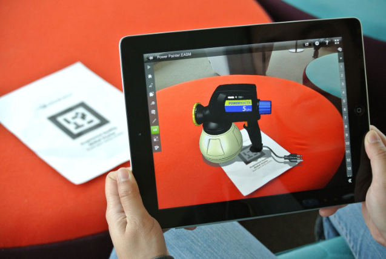
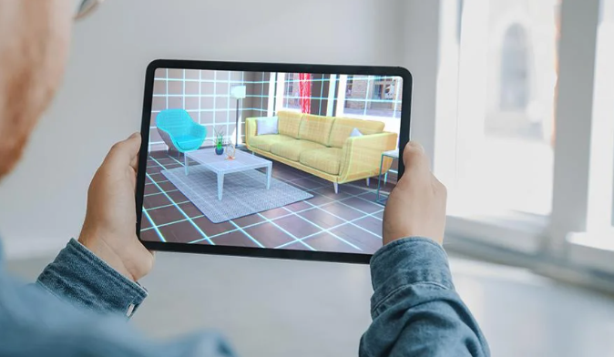

---

# Comprehensive Guide to Augmented Reality (AR) Development

## Introduction

Welcome to the dynamic and immersive realm of Augmented Reality (AR), where digital and physical worlds seamlessly converge. This comprehensive guide will walk you through the essential steps to initiate your AR journey. To enhance your understanding and ease your transition into AR development, we'll start by introducing A-Frame, a versatile and accessible framework for building AR experiences.

## Section 1: Understanding Augmented Reality

Augmented Reality is the integration of digital content with the user's real-world environment in real-time. It enhances the physical world by overlaying digital information, creating interactive and engaging user experiences.

## Section 2 : Markers vs. Markerless Tracking in AR

### Markers:

- **Definition:** Physical objects or patterns for precise AR tracking.
- **Identification:** Easily recognizable, ensuring stable tracking.
- **Advantages:** Reliable, predictable, suitable for industrial use.

### Markerless (Non-Marker) Tracking:

- **Definition:** Utilizes computer vision for feature-based tracking.
- **Identification:** Recognizes environmental features without markers.
- **Advantages:** Flexible, natural interaction, adaptable to varied environments.

### Considerations:

- **Precision Requirements:** Markers for precision, markerless for adaptability.
- **Environmental Adaptability:** Markerless is more versatile.
- **User Experience:** Markers for predictability, markerless for natural feel.
- **Application Context:** Choose based on specific project goals and constraints.

## Section 3: Augmented Reality Frameworks for iOS and Android

### 3.1 ARKit for iOS

ARKit is Apple's AR development framework, enabling developers to create immersive AR experiences for iOS devices.

### 3.2 ARCore for Android

ARCore  is Google's AR development platform, offering AR capabilities for Android devices.

## Section 4: Augmented Reality in Gaming

### 4.1 Unity3D for AR Game Development

Explore Unity3D for creating AR games that blend digital elements with the real world. Unity's AR Foundation provides a cross-platform framework for AR game development.

### 4.2 Unreal Engine for AR Game Development

Unreal Engine, known for its game development capabilities, also supports AR game development. Leverage its robust features for creating visually stunning AR gaming experiences.

## Section 5: Beyond AR - Exploring Additional AR Platforms

### 5.1 Lens Studio by Snap Inc.

#### 5.1.1 What is Lens Studio?

Lens Studio is an AR development platform by Snap Inc., designed to create augmented reality experiences for Snapchat. It allows developers to build interactive AR lenses that users can experience and share through the Snapchat app.

#### 5.1.2 Getting Started with Lens Studio

1. **Download Lens Studio:** Visit the [Lens Studio website](https://lensstudio.snapchat.com/) and download the Lens Studio application.

2. **Explore Templates and Guides:** Lens Studio offers templates and guides to help you create various AR experiences, from face filters to world lenses.

3. **Scripting with JavaScript:** Lens Studio uses JavaScript for scripting, making it accessible to developers familiar with web development.

### 5.2 Meta Spark

#### 5.2.1 What is Meta Spark?

Meta Spark is an AR development platform by Meta, the company formerly known as Facebook. It is part of the broader AR and VR ecosystem created by Meta and offers tools for building augmented reality experiences.

#### 5.2.2 Getting Started with Meta Spark

1. **Join the Spark AR Community:** Explore the [Spark AR website](https://sparkar.facebook.com/) and join the Spark AR community to access resources and tutorials.

2. **Download Spark AR Studio:** Download the Spark AR Studio application, which is the development environment for creating AR effects.

3. **Learn from Tutorials:** Spark AR provides a range of tutorials and documentation to guide you through the process of creating AR effects for the Facebook platform.

## Section 6: Future Trends in Augmented and Virtual Reality

### 6.1 Machine Learning and AI in AR/VR

Explore the integration of machine learning and artificial intelligence in AR and VR applications, enhancing object recognition and enabling more intelligent and context-aware experiences.

### 6.2 Wearable AR/VR Devices

With the rise of AR glasses and smart eyewear, delve into developing AR and VR experiences specifically tailored for wearable devices, providing users with hands-free and immersive interactions.

## Conclusion

Congratulations on your exploration of the diverse landscape of augmented and virtual reality! From web-based AR to persistent AR experiences, gaming, and exploring platforms like A-Frame, Lens Studio, and Meta Spark, you've covered a wide array of possibilities. Keep abreast of emerging trends and technologies, experiment with various frameworks and platforms, and continue contributing to the dynamic and ever-evolving field of augmented and virtual reality. Happy coding in the fascinating world of AR and VR!