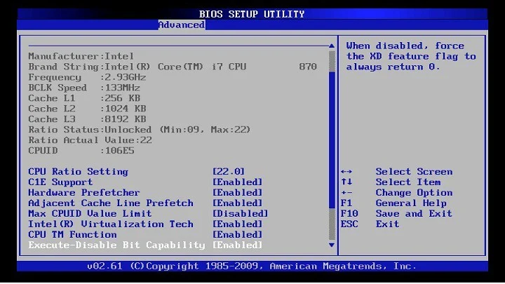

## bios documentation

### ⭐ about , history , succession
1. full form of bios is basic input output system.
2. It is also known as System BIOS, ROM BIOS, BIOS ROM or PC BIOS.
3. Originally, BIOS firmware was stored in a ROM chip on the PC motherboard. 
4. In later computer systems, the BIOS is stored on flash memory so it can be rewritten without removing the chip from the motherboard.
5. Unified Extensible Firmware Interface (UEFI) is a successor to the legacy PC BIOS, aiming to address its technical limitations

_in_a_Winbond_W39V040APZ-5491.jpg)

### ⭐ working of bios
1. BIOS is firmware that is used to provide runtime services for operating systems and manages data flow between the computer's operating system  and attached devices, such as the hard disk, video adapter, keyboard, mouse and printer.
2. bios is located in rom in the motherboard
3. the work of bios is to check if all the hardware and drivers are working properly. this is a POST (Power-On Self-Test). 
4. The POST helps the computer to boot up properly .
5. computer produces various forms of beeps if the POST test fails at the time of test
6. Once it make sures that everything is working fine , then it loads the operating system from the hard disk into the ram.
7. and then the system opens up
8. BIOS is not dependent on anyone that means it does not matter which types of an operating system is running on the computer like Windows 7, Windows 8, Windows 10, Windows XP, Linux, Windows Vista, Unix, or no operating system at all, BIOS functions outside of the operating system environment.

### ⭐ bios user interface
1. Users can perform different functions by using the BIOS user interface.
2. It is a configuration software, also known as CMOS setup, that allows users to configure PC settings, time and date, computer password.
3. To enter the CMOS Setup, you must press a certain key  during the initial startup sequence. Most systems use "Esc," "Del, etc. to enter setup.
4. Once you have entered setup, you will see a set of text screens with a number of options. Some of these are standard, while others vary  according to the BIOS manufacturer. Common options include:

- System Time/Date - Set the system time and date
- Mouse/Keyboard - "Enable Num Lock," "Enable the Keyboard," "Auto-Detect Mouse"
- Drive Configuration - Configure hard drives, CD-ROM and floppy drives
- Memory - Direct the BIOS to shadow to a specific memory address
- Security - Set a password for accessing the computer
- Power Management - Select whether to use power management, as well as set the amount of time for standby and suspend
- Exit - Save your changes, discard your changes or restore default settings 

5. The NVRAM, non-volatile memory, is used to store settings of memory, disk types, and information about the computer system; this information is not stored in the BIOS chip
6. The users run the BIOS setup program during the installation of a system and input the correct parameters. 
7. The CMOS (Complementary metal-oxide-semiconductor) is a required material to construct NVRAM. 
8. These CMOS chips store and maintain data on very low values of current. 
9. Therefore, the system's configurations are also called CMOS settings. 

### ⭐ parting notes

go to cmos settings in your laptop and explore cmos
happy exploring !
