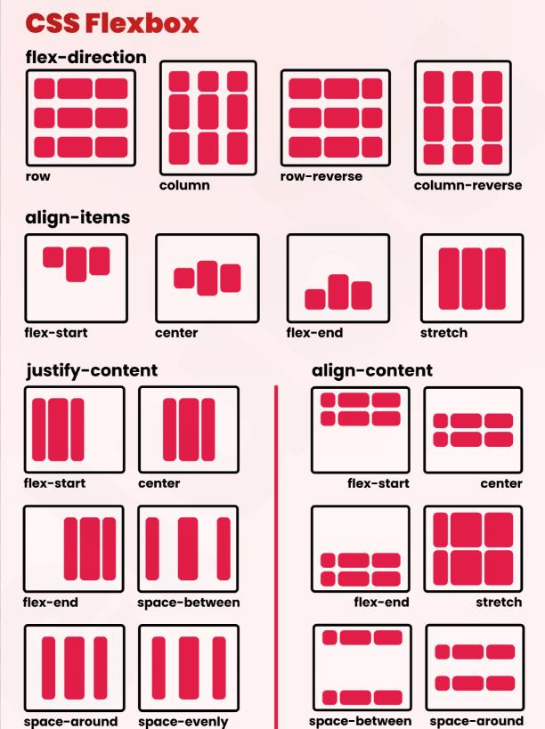
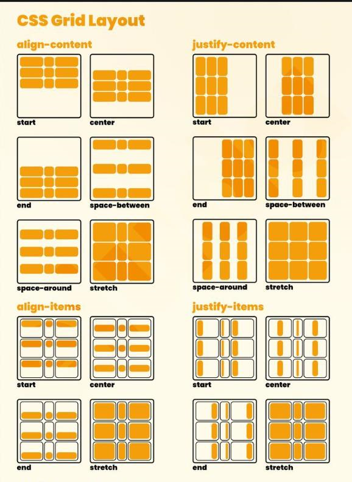

Getting Started with CSS Flexbox and Grid Layout 
 
Getting Started 
(image-15.png)
Flexbox: 
Purpose: Flexbox is a one-dimensional layout model, meaning it deals with either rows or columns at a time. It's excellent 
for arranging items within a container along a single axis or wrapping them if needed. 
Key Concepts: 
Flex Container: This is the parent element which contains flex items. 
Flex Items: The children of the flex container that are laid out using Flexbox properties. 
Main Axis and Cross Axis: Flexbox operates along a main axis and a cross axis. The main axis is defined by the flex-
direction property and determines the direction in which flex items are placed. 
Justify Content: Aligns flex items along the main axis. 
Align Items and Align Content: Aligns flex items and their lines along the cross axis. 
CSS Grid: 
Purpose: CSS Grid is a two-dimensional layout system, allowing you to create layouts with rows and columns 
simultaneously. It provides precise control over the placement and sizing of items. 
Key Concepts: 
Grid Container: The parent element holding grid items. 
Grid Items: The children of the grid container are positioned in rows and columns. 
Grid Lines and Tracks: Grid lines define the horizontal and vertical divisions within the grid, creating rows and columns. 
Tracks are the spaces between these lines. 
Grid Template Areas: Named grid areas that allow you to place items within specific regions of the grid. 
Grid Template Columns and Rows: Define the size of columns and rows within the grid. 
 
Using Flexbox: 
Step 1: Setting up a Flex Container 
To use Flexbox, designate an element as a flex container by applying the display: flex; property to it. 
HTML: 

   

Item 1
   

Item 2
   

Item 3
   

 
 
CSS: 
.flex-container { 
  display: flex; 
  /* Optionally, set flex-direction, justify-content, align-items, etc. */ 
} 
.flex-item { 
  /* Apply styles to individual flex items */ 
} 
 
Step 2: Applying Flex Properties  

Use various Flexbox properties to control the layout: 
flex-direction: Determines the main axis direction (row, row-reverse, column, column-reverse). 
justify-content: Aligns items along the main axis. 
align-items and align-self: Align items along the cross axis. 
flex: Combines flex-grow, flex-shrink, and flex-basis. 
 
Using Grid Layout: 
Step 1: Creating a Grid Container 
To use CSS Grid, designate an element as a grid container by applying the display: grid; property. 
HTML: 

  
  
Item 1
  
  
Item 2
  
  
Item 3
  

 
CSS: 

  
  
Item 1
  
  
Item 2
  
  
Item 3
  

 
Step 2: Defining Grid Properties 

Utilize Grid properties to create a grid layout: 
grid-template-columns and grid-template-rows: Define the size and number of columns and rows. 
grid-gap: Specifies the gap between grid items. 
grid-column and grid-row: Control the placement of items within the grid.