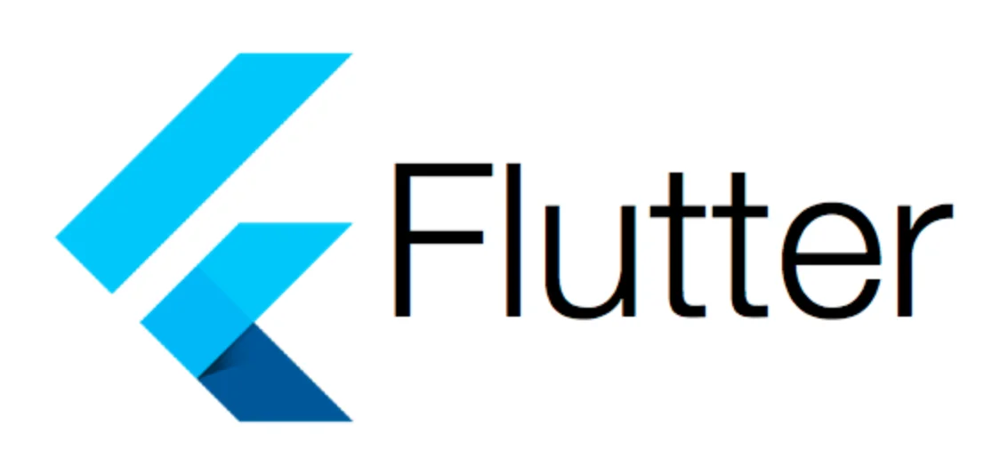
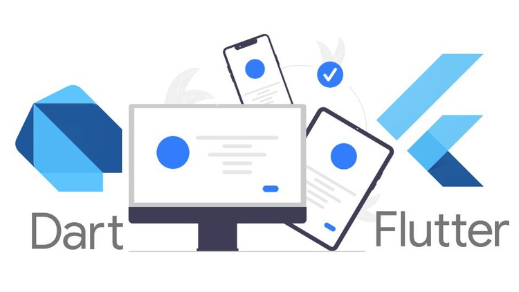

# FLUTTER AND DART

## INTRODUCTION TO FLUTTER

Flutter is an open-source UI software development toolkit created by Google for building natively compiled applications for mobile, web, and desktop from a single codebase. It is designed to make the process of developing high-performance, visually appealing, and cross-platform applications more efficient.

Key features of Flutter include:

1. **Single Codebase:** Flutter allows developers to write code once and run it on multiple platforms, including iOS, Android, web, and desktop. This can significantly reduce development time and effort compared to maintaining separate codebases for each platform.

2. **Widgets:** Flutter uses a declarative approach to building user interfaces through the use of widgets. Widgets are the basic building blocks of Flutter applications and can be combined to create complex UIs. Flutter provides a rich set of pre-designed widgets for common UI elements, as well as the flexibility to create custom widgets.

3. **Hot Reload:** One of Flutter's standout features is its hot reload capability. This allows developers to see the results of code changes in real-time without restarting the entire application. It greatly speeds up the development process and facilitates experimentation with the UI.

4. **High Performance:** Flutter compiles to native ARM code, providing high performance and smooth animations. The framework is optimized for 60 frames per second (fps) performance, resulting in a responsive and fluid user experience.

5. **Rich Ecosystem:** Flutter has a growing ecosystem of packages and plugins that can be easily integrated into your application. This includes libraries for state management, networking, database access, and more.

6. **Material Design and Cupertino Widgets:** Flutter supports both Google's Material Design and Apple's Cupertino design language, making it easy to create applications that adhere to the design guidelines of both major mobile platforms.

7. **Community Support:** Flutter has a vibrant and active community of developers, which means there are plenty of resources, tutorials, and plugins available. The community also contributes to the continuous improvement and expansion of the framework.

8. **Versatility:** In addition to mobile and web applications, Flutter can be used to build desktop applications for platforms like Windows, macOS, and Linux.

### USES OF FLUTTER

Flutter is used for several reasons, and its popularity has grown rapidly in the software development community. Here are some key reasons why developers choose to use Flutter:

1. **Cross-Platform Development:**
   - **Single Codebase:** Flutter enables developers to write code once and deploy it on multiple platforms, including iOS, Android, web, and desktop. This significantly reduces development time and effort compared to maintaining separate codebases for each platform.
   - **Consistent UI:** Flutter provides a consistent look and feel across platforms, ensuring a unified user experience regardless of the device or operating system.

2. **Expressive and Productive UI Development:**
   - **Widget-Based Architecture:** Flutter uses a widget-based system, where everything, from structural elements to stylistic elements, is a widget. This modular approach makes it easy to create complex UIs and encourages code reusability.
   - **Hot Reload:** The hot reload feature allows developers to see the results of code changes in real-time without restarting the entire application. This speeds up the development process and facilitates quick experimentation with the UI.

3. **Performance:**
   - **Native Compilation:** Flutter compiles to native ARM code, resulting in high-performance applications with smooth animations and a responsive user interface.
   - **60 FPS Standard:** Flutter is optimized for 60 frames per second (fps) performance, providing a fluid and visually appealing experience.

4. **Rich Ecosystem and Community:**
   - **Growing Package Ecosystem:** Flutter has a growing ecosystem of packages and plugins that can be easily integrated into applications. This includes libraries for state management, networking, database access, and more.
   - **Active Community:** Flutter has a vibrant and active community of developers who contribute to forums, provide support, and create additional resources like tutorials and plugins.

## INTRODUCTION TO DART

Dart is a programming language developed by Google, designed for building web, mobile, and desktop applications. It was first unveiled in 2011 and has since evolved to become the primary language for developing applications using the Flutter framework. Dart is known for its simplicity, productivity, and versatility, and it serves as the underlying language for Flutter development.

Key features of Dart include:

1. **Object-Oriented:**
   - Dart is an object-oriented programming language, which means it uses objects to model and organize code. This paradigm allows developers to structure their code in a way that promotes modularity, reusability, and maintainability.

2. **Strong Typing:**
   - Dart is a statically-typed language, meaning that variable types are known at compile time. This can help catch certain types of errors early in the development process, improving code reliability and maintainability.

3. **Just-In-Time (JIT) and Ahead-of-Time (AOT) Compilation:**
   - Dart uses a combination of JIT and AOT compilation. During development, Dart uses JIT compilation to enable features like hot reload in Flutter, allowing developers to see the results of code changes in real-time. For production, Dart can be compiled to native machine code using AOT compilation, resulting in optimized and efficient execution.

4. **Concurrency Model:**
   - Dart supports asynchronous programming, making it well-suited for handling concurrent operations. The language provides features like async/await for writing asynchronous code, making it easier to manage tasks such as network requests and I/O operations without blocking the main thread.

5. **Garbage Collection:**
   - Dart incorporates automatic garbage collection, which helps manage memory by automatically reclaiming unused memory, reducing the risk of memory leaks and improving overall application stability.

6. **Dart SDK:**
   - The Dart SDK (Software Development Kit) includes the Dart programming language, libraries, and tools for development. It provides a comprehensive set of tools for compiling Dart code, managing dependencies, and more.

7. **Flutter Development:**
   - Dart has gained prominence as the language of choice for Flutter development. Flutter is an open-source UI toolkit for building natively compiled applications for mobile, web, and desktop. Dart's features, such as its hot reload capability and high-performance execution, contribute to the development speed and efficiency in the Flutter framework.

8. **Web Development:**
   - Dart can also be used for web development, both on the client-side and server-side. Dart web applications can be compiled to JavaScript to run in modern web browsers.

9. **Growing Ecosystem:**
   - Dart has a growing ecosystem of packages and libraries that can be easily integrated into Dart projects. These packages cover a wide range of functionalities, including networking, database access, state management, and more.

### APPLICATION OF DART

Dart is a versatile programming language that finds applications in various domains, thanks to its features like simplicity, productivity, and its association with the Flutter framework. Here are some key applications of Dart:

1. **Flutter Mobile App Development:**
   - Dart is primarily known for being the language used in conjunction with the Flutter framework for building cross-platform mobile applications. Flutter enables developers to write code once and deploy it on both iOS and Android platforms, resulting in a more efficient development process.

2. **Web Development:**
   - Dart can be used for web development, both on the client and server side. Dart web applications can be compiled to JavaScript to run in modern web browsers. The Dart SDK provides libraries and tools for building interactive and scalable web applications.

3. **Desktop Applications:**
   - With Flutter's expansion to support desktop platforms like Windows, macOS, and Linux, Dart can be used to build desktop applications that maintain a consistent look and feel across different operating systems.

4. **Server-Side Development:**
   - Dart can be utilized for server-side development, and it has frameworks like Aqueduct for building scalable and efficient server applications. Dart's asynchronous programming features are particularly useful for handling concurrent operations on the server.

5. **Command-Line Tools:**
   - Dart is suitable for building command-line tools and scripts. Its syntax and features make it a good choice for creating efficient and maintainable scripts to automate tasks.

6. **Internet of Things (IoT):**
   - Dart's lightweight nature and support for embedded systems make it applicable for developing applications in the Internet of Things (IoT) space. It can be used to create software for various IoT devices.

7. **Game Development:**
   - While not as prevalent as other languages in the game development space, Dart can be used for building simple to moderately complex games. Flutter's support for custom painting and animations enhances Dart's suitability for game development.

8. **Educational Purposes:**
   - Dart's simplicity and ease of learning make it a suitable choice for educational purposes. It is often used as an introductory language for programming courses.

9. **Command-Line Interfaces (CLIs):**
   - Dart can be employed to build command-line interfaces for applications, allowing developers to interact with software through the terminal. Dart's features, such as its strong typing and support for asynchronous programming, can enhance the development of robust CLIs.

10. **Packages and Libraries:**
    - Dart has a growing ecosystem of packages and libraries, covering a wide range of functionalities. Developers can leverage these packages to accelerate development and add features to their Dart projects, whether they are mobile apps, web applications, or server-side applications.
