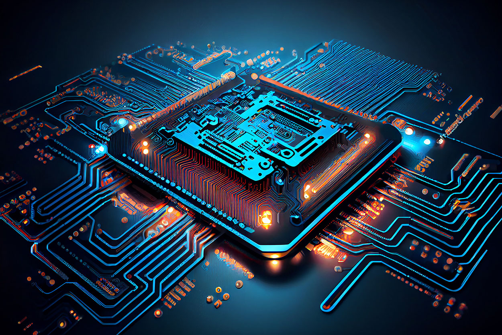
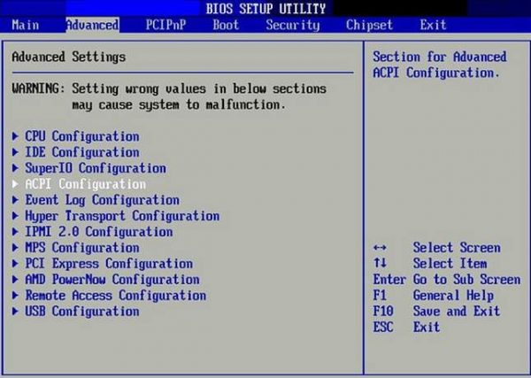
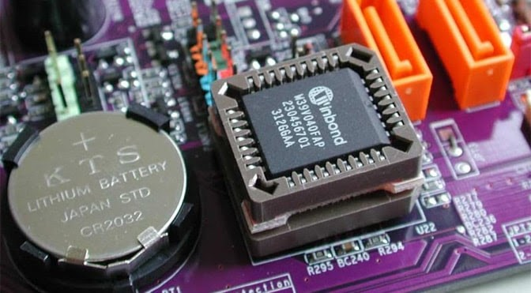

# Quantum Computing 

##  Introduction

###  Overview

Quantum computing is a revolutionary field of study that harnesses the principles of quantum mechanics to perform computations. Unlike classical computers that use bits, which can be either 0 or 1, quantum computers use quantum bits or qubits, which can exist in multiple states simultaneously.

### Importance of Quantum Computing

Quantum computing holds the potential to solve complex problems that are practically impossible for classical computers. It promises breakthroughs in cryptography, optimization, and artificial intelligence, among other fields.

##  Applications

### Cryptography

Quantum computers threaten current cryptographic systems by their ability to quickly factorize large numbers, rendering widely used encryption methods insecure. Post-quantum cryptography research aims to develop quantum-resistant algorithms.

### Optimization Problems

Quantum computing excels in solving optimization problems, such as finding the most efficient routes in logistics or optimizing financial portfolios.

### Machine Learning

Quantum machine learning explores how quantum algorithms can enhance certain machine learning tasks, offering potential advantages in speed and efficiency.

### Drug Discovery

Quantum computing can simulate molecular interactions more accurately than classical computers, accelerating drug discovery and development processes.

### Supply Chain Optimization

Quantum computing can optimize complex supply chain networks, leading to more efficient resource allocation and reduced costs.

## Challenges and Limitations

### Decoherence

Decoherence occurs when quantum systems interact with their environment, causing the loss of quantum information. Maintaining coherence is a significant challenge in building practical quantum computers.

### Error Correction

Quantum error correction is crucial for addressing errors that naturally occur in quantum computations. Developing effective error-correction methods is an ongoing area of research.

### Scalability

Building large-scale, fault-tolerant quantum computers remains a challenge due to the intricate requirements of maintaining qubit coherence and entanglement over extended periods.

### Quantum Noise

Quantum noise, arising from various sources, can interfere with the accuracy of quantum computations. Reducing quantum noise is vital for improving the reliability of quantum computers.

## Future Prospects

### Quantum Communication

Quantum communication technologies, such as quantum key distribution, offer secure communication channels, and the development of a quantum internet is underway.

### Quantum Internet

A quantum internet could revolutionize communication by enabling secure quantum communication over long distances.

### Quantum AI

Combining quantum computing with artificial intelligence has the potential to enhance machine learning algorithms and solve complex AI problems more efficiently.

### Quantum Cloud Computing

Quantum cloud computing services may enable organizations to access quantum resources remotely, fostering broader adoption and collaboration.

## Ethical Considerations

### Privacy Concerns

Quantum computing's potential to break existing encryption methods raises concerns about the privacy and security of sensitive information.

### Security Implications

While quantum technologies offer new security measures, they also introduce new vulnerabilities. Ongoing research is crucial to understand and address these security implications.

### Socioeconomic Impact

The widespread adoption of quantum computing could lead to significant socioeconomic changes, influencing job markets, industries, and global competitiveness.

## QUANTUM COMPUTING VERSUS CLASSICAL COMPUTING

Quantum computing and classical computing represent two fundamentally different paradigms of computation, each with its own strengths and weaknesses. Here's a comparison between quantum computing and classical computing across various aspects:

## 1. **Basic Unit of Information:**

- **Classical Computing:**
  - Uses classical bits as the basic unit of information.
  - Bits can exist in one of two states: 0 or 1.

- **Quantum Computing:**
  - Utilizes quantum bits, or qubits, as the basic unit of information.
  - Qubits can exist in multiple states simultaneously due to the principles of superposition.

## 2. **Information Processing:**

- **Classical Computing:**
  - Processes information using classical logic gates, performing operations sequentially.
  - Follows deterministic logic, where each computation step is well-defined.

- **Quantum Computing:**
  - Leverages quantum gates to perform operations on qubits.
  - Utilizes principles such as superposition and entanglement to process information in parallel, potentially offering exponential speedup for certain algorithms.

## 3. **Parallelism:**

- **Classical Computing:**
  - Processes information sequentially, limiting parallelism to multiple processors or cores.

- **Quantum Computing:**
  - Exploits quantum superposition to perform parallel computations on multiple states simultaneously, potentially leading to exponential parallelism.

## 4. **Entanglement:**

- **Classical Computing:**
  - No inherent concept of entanglement.
  - Information in classical systems is independent of each other.

- **Quantum Computing:**
  - Qubits can be entangled, meaning the state of one qubit is directly linked to the state of another, regardless of the physical distance between them.

## 5. **Error Correction:**

- **Classical Computing:**
  - Uses well-established error correction techniques and redundancy.

- **Quantum Computing:**
  - Quantum error correction is a complex and active area of research due to the susceptibility of qubits to environmental interference (decoherence).

## 6. **Speed and Efficiency:**

- **Classical Computing:**
  - Well-suited for a wide range of general-purpose tasks.
  - Efficient for many everyday applications.

- **Quantum Computing:**
  - Has the potential to provide exponential speedup for specific algorithms, solving certain problems much faster than classical computers.

## 7. **Applications:**

- **Classical Computing:**
  - Dominates current computing infrastructure for most applications, including data processing, software development, and everyday computing tasks.

- **Quantum Computing:**
  - Holds promise for solving complex problems in areas such as cryptography, optimization, material science, and machine learning. Early-stage applications are being explored.

## 8. **Decoherence and Stability:**

- **Classical Computing:**
  - Resistant to environmental interference and remains stable.

- **Quantum Computing:**
  - Susceptible to decoherence, where quantum states degrade due to interactions with the external environment. Maintaining stability is a significant challenge.

## 9. **Scalability:**

- **Classical Computing:**
  - Scalable by adding more processors or improving hardware components.

- **Quantum Computing:**
  - Building large-scale, fault-tolerant quantum computers is challenging due to the delicate nature of qubits and the need to maintain coherence.

## 10. **Energy Efficiency:**

- **Classical Computing:**
  - Generally energy-efficient for common computing tasks.

- **Quantum Computing:**
  - Current quantum computing implementations often require extremely low temperatures and specialized environments, posing challenges for energy efficiency.

## 11. **Cost:**

- **Classical Computing:**
  - Mature technology with well-established infrastructure, making it cost-effective.

- **Quantum Computing:**
  - Expensive due to the complexity of hardware, cryogenic systems, and the need for specialized environments. Costs are expected to decrease as the technology matures.
