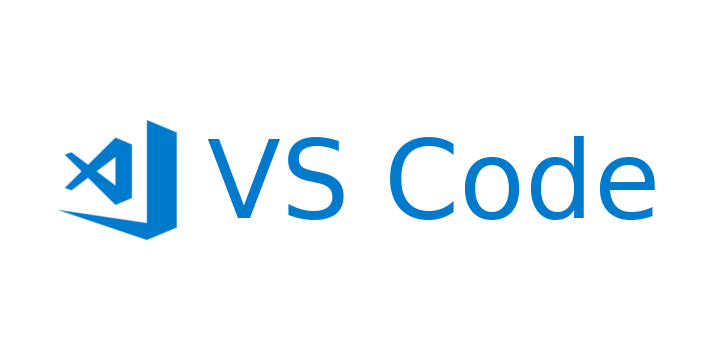
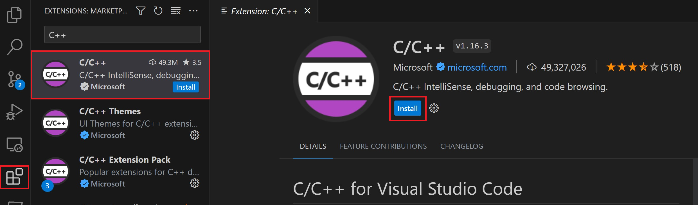

# SOFTWARE INSTALLATION GUIDE OF VS CODE AND C++

## WHAT IS VISUAL STUDIO CODE??


Visual Studio Code (VS Code) is a free, open-source source-code editor developed by Microsoft. It is designed for developers working on a variety of programming languages and provides a lightweight yet powerful environment for coding, debugging, and source code management.

1. **Cross-Platform:** VS Code is available for Windows, macOS, and Linux, making it a versatile choice for developers using different operating systems.

2. **Extensibility:** One of the significant strengths of VS Code is its extensibility. It supports a wide range of extensions that enhance its functionality for various programming languages, frameworks, and tools.

3. **Integrated Development Environment (IDE) Features:** Although VS Code is technically a code editor, it includes many features traditionally associated with integrated development environments. This includes features like syntax highlighting, autocompletion, debugging, and version control.

4. **Built-in Git Integration:** VS Code has built-in Git support, making it easy for developers to manage version control directly within the editor.

5. **Customizable:** Users can customize VS Code to suit their preferences. This includes themes, keyboard shortcuts, and other settings to tailor the development environment to individual needs.

6. **Intelligent Code Editing:** VS Code includes features like IntelliSense, which provides context-aware code completion suggestions, and supports various programming languages out of the box.

7. **Debugger:** VS Code has a built-in debugger that allows developers to debug their code directly within the editor. It supports various languages and provides a visual interface for setting breakpoints, inspecting variables, and more.

8. **Integrated Terminal:** VS Code comes with an integrated terminal, allowing developers to run commands and scripts without leaving the editor.

9. **Large Extension Ecosystem:** The Visual Studio Code Marketplace offers a vast collection of extensions created by the community. These extensions can add support for new languages, provide additional tools, or enhance the editor's functionality.

10. **Community and Support:** Due to its popularity, VS Code has a large and active community. Users can find help, tutorials, and resources from the community to improve their experience with the editor.


## Installing Visual Studio Code:

### Windows:

1. Visit the official VS Code website: [https://code.visualstudio.com/](https://code.visualstudio.com/).
2. Download the installer for Windows.
3. Run the installer and follow the on-screen instructions.
4. Once installed, you can open VS Code by searching for it in the Start menu.

### macOS:

1. Visit the official VS Code website: [https://code.visualstudio.com/](https://code.visualstudio.com/).
2. Download the installer for macOS.
3. Open the downloaded file (`.dmg`) and drag the VS Code icon to the Applications folder.
4. Open VS Code from the Applications folder.

### Linux:

1. On Debian-based systems (e.g., Ubuntu), you can use the following commands in the terminal:
   ```bash
   sudo apt update
   sudo apt install code
   ```

   On Red Hat-based systems (e.g., Fedora), you can use:
   ```bash
   sudo dnf install code
   ```

   Alternatively, you can download the `.deb` or `.rpm` package from the VS Code website and install it manually.

## Installing C++ Extension for Visual Studio Code:


1. Open VS Code.
2. Go to the Extensions view by clicking on the Extensions icon in the Activity Bar on the side of the window or use the shortcut `Ctrl+Shift+X`.
3. Search for "C/C++" in the Extensions view search box.
4. Install the "C/C++" extension provided by Microsoft.

### Configuring C++ Compiler:

1. After installing the C/C++ extension, you might need to configure the C++ compiler.
2. Open a C++ file (with a `.cpp` extension) or create a new one.
3. A pop-up should appear, asking if you want to install the necessary tools. Click "Install" to automatically install the required tools like GCC for compiling C++ code.
4. If the pop-up doesn't appear, you can open the command palette (`Ctrl+Shift+P`), type "C/C++: Select a Kit," and select a compiler kit.

## WOHOO!🥳 NOW YOU ARE READY TO START CODING

### HAPPY LEARNING !!

