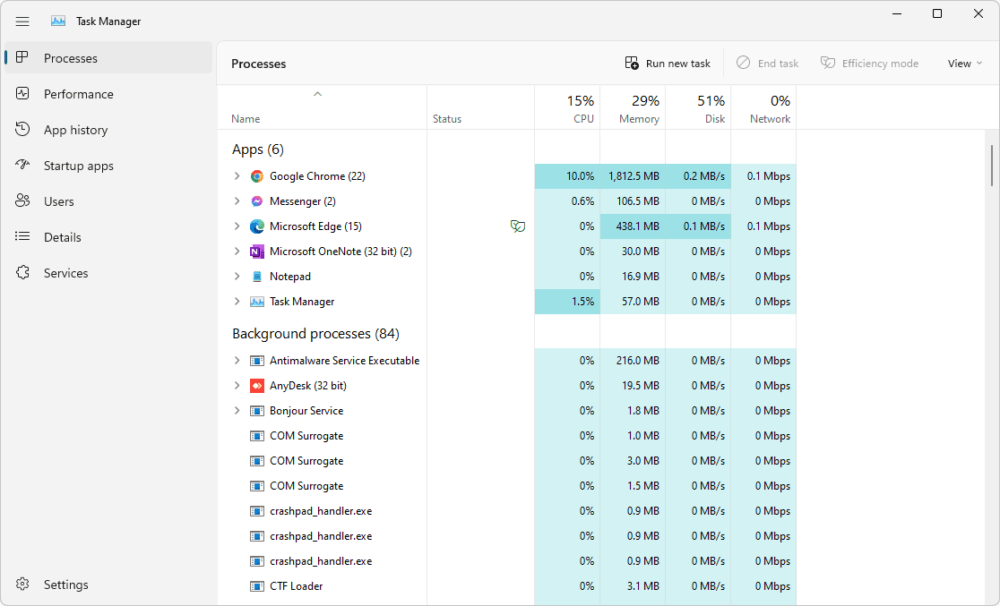
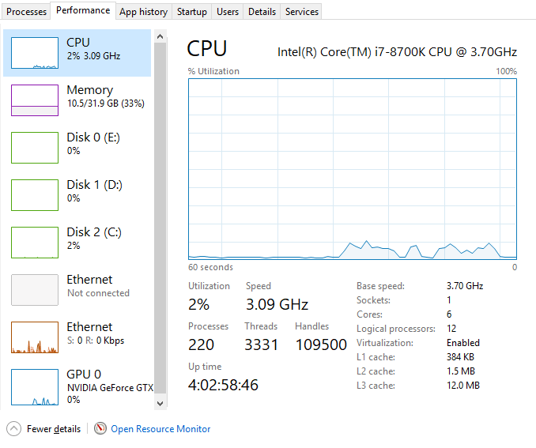
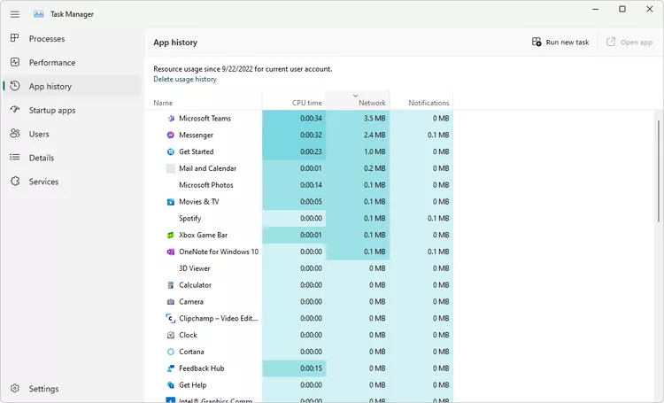
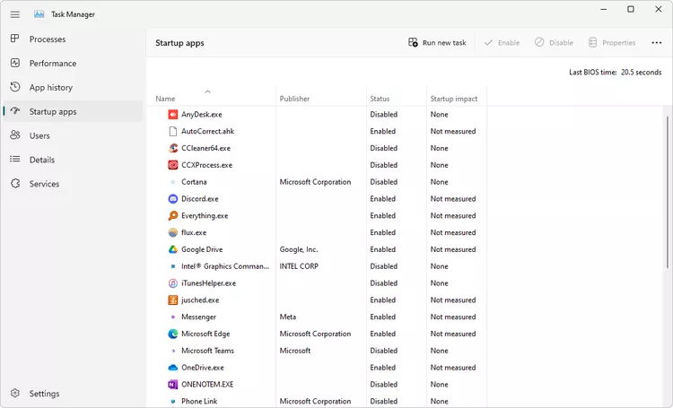
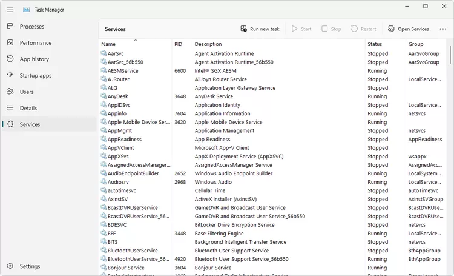

# task manager documentation

## ⭐ how does it look ?

## ⭐ what is task manager
As the name suggests task manager manages the task but the funny fact is that rarely people uses it for managing the tasks , unless they are exposed to the endless possibilities of task manager.
  
  Task manager is an interface where we can actually see how the resources are being utilised by different applications , startup programs and background apps on our system.

what we mean by resources is the following:
1. cpu - total process utilisation across all cores 
1. ram (memory) - physical memory in use by active processes
2. hard disk (disk) - total utilisation across all physical drives
3. internet data (network) - network utilisation on the current primary network

Task Manager is included with Windows 11, Windows 10, Windows 8, Windows 7, Windows Vista, and Windows XP

## ⭐features offered by task manager
at the navigation menu in the left , we have the following list:
1. **process**
- Through this tab , one can run new task as well as end the task.
- now you might argue that we can open and close the application manually also i.e. without opening task manager. So my answer is yes , one can do that manually too.
- but my question to you is how you will close the background apps or any other application that is running behind the scenes . 

for example : 
in windows we have the news feature , where we can see the latest news.these news gets updated in the background continously , even though a person have not opened the news at all. so such prcoesses can be deleted from the task manager.

2. **performance**
  
it contains dynamic graphical and static information  about :
- cpu
- disk
- memory
- gpu
- network

3. **app history**  

as the name suggests we get a list of our used applications with the following information also:
- cpu time
- network
- notification

4. **start up apps**  

it gives the list of apps that automatically starts as the system is turned on.One can enable and disable these start up apps and know there impact also 

5. **users,details and services**  

this gives information about the  the currently logged on Users and Services of the computer. These can be controlled by an Administrator.

## ⭐you should know this :)
Task Manager is a common target of computer viruses and other forms of malware; typically malware will close the Task Manager as soon as it is started, so as to hide itself from users. Some malware  disables task manager as an administrator.
