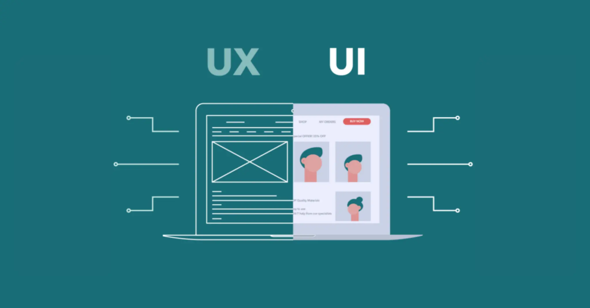
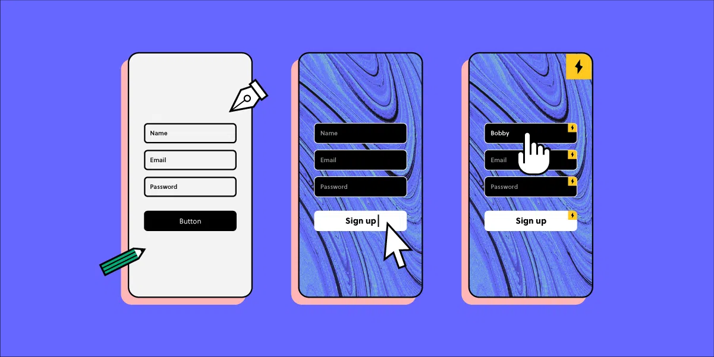
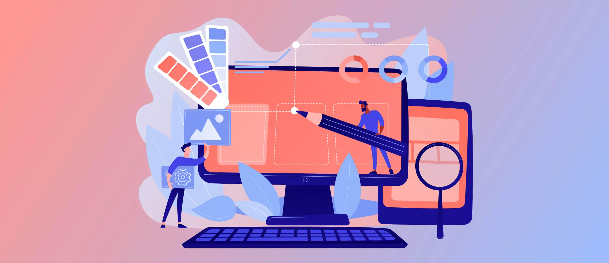

# DOCUMENTATION ON UI/UX

## INTRODUCTION TO UI/UX

**Introduction to UI/UX: Crafting Seamless Digital Experiences**

User Interface (UI) and User Experience (UX) are integral components of digital design, playing a pivotal role in shaping how users interact with software, websites, and applications. In this introduction, we delve into the fundamental concepts of UI/UX, exploring their significance and interplay.

**1. Defining UI and UX:**
   - **UI (User Interface):** Refers to the visual elements, aesthetics, and interactive elements with which users engage. UI design focuses on creating an intuitive and visually appealing interface.
   - **UX (User Experience):** Encompasses the overall user journey, satisfaction, and emotional response during interactions with a product. UX design aims to enhance the usability, accessibility, and delight of the entire user experience.

**2. Importance of Good UI/UX:**
   - **User-Centered Design:** UI/UX design revolves around prioritizing the needs and preferences of users. A user-centered approach ensures that products are not only functional but also enjoyable and efficient.
   - **Business Impact:** Well-designed UI/UX can significantly impact user satisfaction, customer loyalty, and, ultimately, the success of a product or service.

**3. The Relationship between UI and UX:**
   - **Interconnected Elements:** While UI and UX are distinct, they are closely interconnected. A visually appealing UI contributes to a positive UX, and an excellent UX relies on intuitive and aesthetically pleasing UI elements.
   - **Collaborative Design:** Effective collaboration between UI and UX designers is essential to create cohesive and user-friendly digital experiences.

**4. The User-Centric Approach:**
   - **Understanding User Needs:** UI/UX design begins with a deep understanding of the target audience. User research, personas, and scenarios help designers empathize with users and tailor experiences to their expectations.
   - **Iterative Design Process:** UI/UX is an iterative process that involves continuous testing, feedback collection, and refinement to align the product with evolving user expectations.

**5. The Role of UI in UX:**
   - **Visual Design Elements:** UI design focuses on visual elements such as color schemes, typography, and imagery to create an aesthetically pleasing and consistent interface.
   - **Interaction Design:** UI is responsible for designing interactive elements and ensuring a seamless flow of user interactions. Well-designed UI elements enhance the overall user experience.

**6. The Holistic UX Perspective:**
   - **End-to-End Experience:** UX design considers the entire user journey, from the moment a user encounters a product to the completion of their goal. This involves optimizing each touchpoint for usability and satisfaction.
   - **Emotional Design:** UX extends beyond functionality, aiming to evoke positive emotions and create memorable experiences that resonate with users on a deeper level.
  
# WIREFRAMING AND PROTOTYPING

**Wireframing and Prototyping in UI/UX: Blueprinting Seamless Experiences**

Wireframing and prototyping are essential stages in the UI/UX design process, allowing designers to conceptualize and refine the user interface and experience before moving into development. In this exploration, we delve into the significance, methodologies, and best practices of wireframing and prototyping.

**1. Understanding Wireframing:**
   - **Definition:** Wireframing is the preliminary visual representation of a user interface, outlining the skeletal structure and layout of a digital product.
   - **Purpose:** It serves as a low-fidelity blueprint, focusing on the arrangement of elements without detailing visual design, to facilitate early-stage feedback and iteration.

**2. Importance of Wireframing:**
   - **Clarity in Structure:** Wireframes provide clarity on the placement of key elements such as navigation, content, and interactive features.
   - **Early User Feedback:** By presenting a simplified version of the interface, designers can gather early user feedback, ensuring that the basic structure aligns with user expectations.
   - **Efficient Iteration:** As a quick and cost-effective tool, wireframing allows designers to iterate rapidly, refining the layout based on stakeholder and user input.

**3. Wireframing Techniques:**
   - **Paper Sketching:** Quick sketches on paper are an excellent way to ideate and explore layout options.
   - **Digital Tools:** Utilize wireframing tools such as Sketch, Figma, or Adobe XD for more refined digital wireframes.
   - **Lo-Fi vs. Hi-Fi:** Choose between low-fidelity wireframes for basic structure and high-fidelity for more detailed representations, including some visual elements.

**4. Prototyping Defined:**
   - **Definition:** Prototyping involves creating an interactive, functional model of the user interface that simulates user interactions and flow.
   - **Purpose:** It allows stakeholders to experience the product's functionality, providing a tangible preview before investing in development.

**5. Significance of Prototyping:**
   - **User Interaction Simulation:** Prototypes enable designers to simulate user interactions, helping to identify potential usability issues.
   - **Feedback Generation:** Interactive prototypes facilitate more detailed and actionable feedback from stakeholders and users.
   - **Validation of Concepts:** Prototyping allows for the validation of design concepts, reducing the risk of developing a product that doesn't meet user expectations.

**6. Prototyping Methods:**
   - **Clickable Prototypes:** Develop interactive prototypes using specialized tools like InVision, Proto.io, or Marvel.
   - **HTML/CSS Prototypes:** For web-based projects, creating prototypes with basic HTML/CSS and even JavaScript can offer a more realistic experience.
   - **Iterative Prototyping:** Follow an iterative approach, progressively refining the prototype based on feedback and testing results.

**7. Integration of Wireframing and Prototyping:**
   - **Sequential Process:** Typically, wireframing precedes prototyping, as wireframes lay the foundation for the interactive prototype.
   - **Smooth Transition:** Ensure a seamless transition from wireframes to prototypes, maintaining consistency in layout and design elements.

**8. Collaborative Prototyping:**
   - **Team Collaboration:** Collaborative tools enable designers, developers, and stakeholders to contribute to the prototyping process.
   - **Version Control:** Use version control features to track changes and maintain a clear record of the prototyping evolution.

## VISUAL DESIGN

**Visual Design in UI/UX: Crafting Aesthetic and Functional Experiences**

Visual design is a cornerstone of UI/UX, influencing how users perceive and interact with digital products. In this exploration, we'll delve into the importance, principles, and best practices of visual design in the context of user interface and experience.

**1. Importance of Visual Design:**
   - **Aesthetic Appeal:** Visual design focuses on creating an aesthetically pleasing interface, capturing the user's attention and fostering a positive impression.
   - **User Engagement:** Well-crafted visual elements enhance user engagement, making the overall experience more enjoyable and memorable.
   - **Brand Identity:** Visual design contributes to establishing and reinforcing brand identity through consistent use of colors, typography, and imagery.

**2. Principles of Visual Design:**
   - **Hierarchy:** Establish a visual hierarchy to guide users through the content, emphasizing key elements and maintaining a logical flow.
   - **Consistency:** Maintain visual consistency across the interface, ensuring that design elements align with established patterns and standards.
   - **Contrast:** Use contrast in color, size, and shape to highlight important elements and create visual interest.
   - **Alignment:** Ensure a clean and organized appearance by aligning elements in a logical and visually pleasing manner.
   - **Repetition:** Repeated use of design elements fosters a cohesive and recognizable interface.

**3. Color Theory and Palette Selection:**
   - **Psychology of Color:** Understand the psychological impact of colors on user emotions and perceptions.
   - **Color Harmony:** Create a harmonious color palette that reflects the brand identity and supports the overall mood of the interface.
   - **Accessibility:** Consider color accessibility standards to ensure a positive experience for users with visual impairments.

**4. Typography in UI/UX:**
   - **Readability:** Choose fonts and font sizes that enhance readability, considering the context and content hierarchy.
   - **Hierarchy Through Typography:** Utilize variations in font weight, style, and size to establish a clear visual hierarchy.
   - **Consistent Typography:** Maintain consistency in typography across the interface for a cohesive look and feel.

**5. Iconography and Imagery:**
   - **Icon Design:** Design clear and recognizable icons to convey information efficiently, enhancing the user's understanding of actions and features.
   - **Imagery Selection:** Choose images that align with the brand and resonate with the target audience, considering cultural and contextual factors.
   - **Optimization:** Optimize images for performance, ensuring fast loading times without compromising quality.

**6. Responsive Visual Design:**
   - **Adaptive Layouts:** Design interfaces that adapt seamlessly to various screen sizes and resolutions.
   - **Mobile-First Approach:** Consider the mobile user experience first, ensuring that visual elements are optimized for smaller screens.

**7. Accessibility in Visual Design:**
   - **Contrast and Readability:** Ensure sufficient contrast between text and background colors for users with visual impairments.
   - **Alt Text for Images:** Provide descriptive alt text for images to make content accessible to users with visual disabilities.
   - **Navigational Clarity:** Design clear and intuitive navigation elements to aid users with different abilities.

**8. Trends and Innovation:**
   - **Stay Current:** Keep abreast of current design trends and innovations while considering their relevance to the brand and user base.
   - **Balancing Trend and Timelessness:** Strive for a balance between incorporating modern trends and maintaining a timeless design that stands the test of time.

