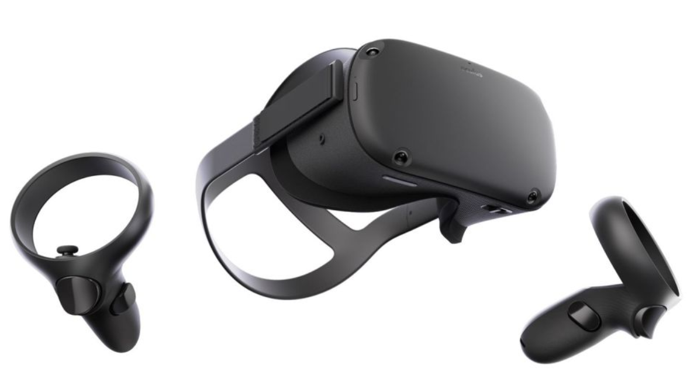
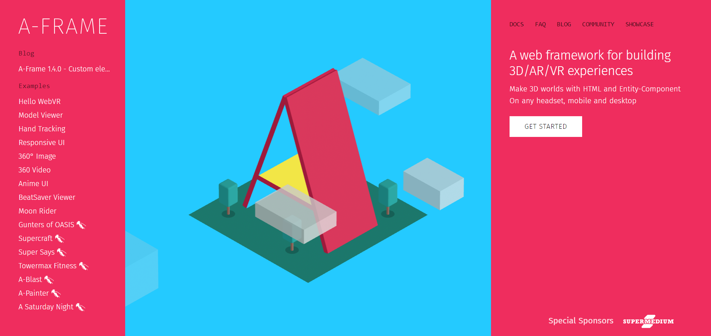

# Getting Started with Virtual Reality


## Introduction

The Virtual Reality (VR) space is where immersive experiences and limitless possibilities await. This crisp guide will walk you through the essential steps to get started on your VR journey. We'll begin by introducing you to the fundamentals, which, before getting started, you will feel is very difficult to implement. Still, as soon as you start reading ahead, you will realize that virtual reality is just indeed a fancy word.


## Section 1: Understanding Virtual Reality


### 1.1 What is Virtual Reality?

Virtual reality is nothing but a computer-generated environment that simulates a realistic experience, often involving sight and sound(sound is indeed optional but indeed adds up the level of immersion). Users are transported to a digital world, creating an immersive and interactive experience.

### 1.2 Key Components of Virtual Reality

To understand VR, familiarize yourself with these key components:

- **Headset:** The device worn on the head to view virtual content.
- **Controllers:** Input devices for interacting with the virtual environment.
- **Sensors:** Track the user's movements for a more immersive experience.



But it is not necessary that you compulsorily require the hardware to develop a virtual reality environment. The main focus of this documentation is WebVr, which is a virtual reality experience on the 
web. So you just require the following:
1. laptop/computer
2. mouse 
3. keyboard 
4. no pre-requisite (even HTML knowledge is also not required)
and you are good to go.

## Section 2: Introduction to A-Frame


### 2.1 What is A-Frame?

A-Frame is an open-source web framework for building VR experiences. It is designed to simplify the creation of VR content, making it accessible to developers and enthusiasts alike.

### 2.2 Why A-Frame?

- **Web-Based:** A-Frame leverages web technologies, allowing you to build VR experiences using HTML and JavaScript.
- **Ease of Use:** A-Frame's declarative syntax makes it easy for beginners to create VR content without a steep learning curve.
- **light-weight:** It does not requrire much RAM.so the excellent point is that 4GB RAM is also sufficient for running a virtual reality experience over the web.
### 2.3 Setting Up A-Frame

Follow these steps to set up A-Frame:

1. **Open any code editor:** Ensure you have a code editor where you usually write your "hello world" programs.

2. **Create a Project Directory:** Set up a dedicated folder for your A-Frame projects.

3. **Include A-Frame Library:** Add the A-Frame library to your project by including the following script tag in your HTML file:

```HTML
    <script src="https://aframe.io/releases/1.5.0/aframe.min.js"></script>
```

## Section 3: Building Your First A-Frame Scene

### 3.1 Creating the HTML Structure

Firstly, create an HTML structure before creating an A-Frame scene. Use the A-Frame entity component to define objects in the virtual environment.

```html
<!DOCTYPE html>
<html lang="en">
<head>
  <meta charset="UTF-8">
  <meta name="viewport" content="width=device-width, initial-scale=1.0">
    <script src="https://aframe.io/releases/1.5.0/aframe.min.js"></script>
  <title>Your VR Experience</title>
</head>
<body>
  <a-scene>
    <!-- Your A-Frame entities go here -->
  </a-scene>
</body>
</html>
```

### 3.2 Adding Entities to the scene

Enhance your A-Frame scene by adding entities such as geometries, textures, and lights. Customize your virtual environment to create a unique and engaging experience.

```html
<a-box position="-1 0.5 -3" rotation="0 45 0" color="#4CC3D9"></a-box>
<a-sphere position="0 1.25 -5" radius="1.25" color="#EF2D5E"></a-sphere>
<a-cylinder position="1 0.75 -3" radius="0.5" height="1.5" color="#FFC65D"></a-cylinder>
```

### 3.3 Interactivity with A-Frame Components

Explore A-Frame components to add interactivity to your VR scene. Components enable you to define behaviors and interactions within the virtual environment.

```html
<a-box position="0 2 -5" color="tomato" scale="2 2 2" 
       animation="property: rotation; to: 0 360 0; loop: true; dur: 5000">
</a-box>
```

## Section 4: Further Resources and Next Steps

### 4.1 Learning A-Frame in Depth

To deepen your understanding of A-Frame, explore the official documentation and community resources:

- [A-Frame Documentation](https://aframe.io/docs/1.2.0/introduction/)
- [A-Frame School](https://aframe.io/aframe-school/)

### 4.2 Continuing Your VR Journey

As you become more comfortable with A-Frame, consider exploring advanced VR development concepts, experimenting with different A-Frame components, and contributing to the A-Frame community.

## Conclusion

Congratulations on taking the first steps into the captivating world of Virtual Reality! With A-Frame as your stepping stone, you are well on your way to creating immersive and interactive VR experiences. Embrace the learning process, experiment with A-Frame, and unlock the full potential of virtual reality.