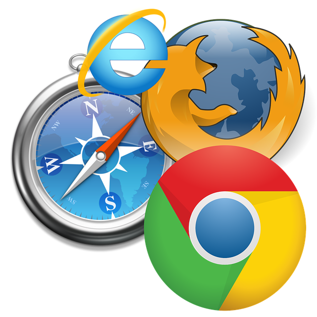
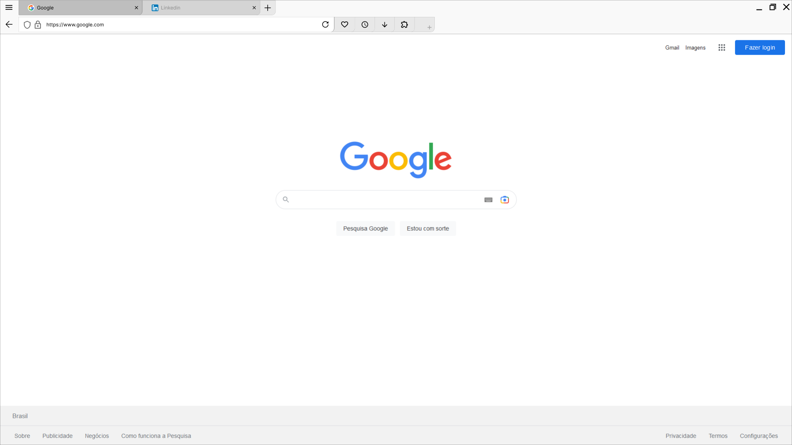

# Web Browser Documentation

## ⭐ About Web Browsers

1. A web browser is an application for accessing websites, i.e., fetching content from the World Wide Web and displaying it on a user's device. 
2. When a user requests a web page by typing the URL, the browser retrieves its files from a web server and then displays the page on the user's screen.
3. All URLs are retrieved using the Hypertext Transfer Protocol (HTTP), a set of rules for data transfer. 
4. If the URL uses the secure mode of HTTP (HTTPS), the connection between the browser and the web server is encrypted for communications security and information privacy.

## ⭐ Common Features of Web Browsers

During browsing cookies get stored in the web browsers and this helps in tracking user's activity.

1. They automatically log users' browsing history, unless the users turn off their browsing history or use the non-logging private mode.  2. They also allow users to set bookmarks.
3. browsers can be customized with extensions.
4. It can manage user passwords.
5. They provide sync services and web accessibility features.
6. Most browsers have common user interface features such as:
- Allowing the user to having multiple pages open at the same time, either in different browser windows or in different tabs of the same window.
- Back and forward buttons to go back to the previous page visited or forward to the next one.
- A refresh or reload and a stop button to reload and cancel loading the current page. 
- A home button to return to the user's home page.
- The difference is significant for users accustomed to keyboard shortcuts.

## ⭐ Market share of different browsers

1. **Google Chrome** - 65% global market share on all devices.
2. **Safari** -18% global market share on all devices 
3. **Microsoft Edge** has the second-highest desktop share.
4. **Mozilla Foundation's Firefox** is the fourth most popular desktop browser.
5. Some alternative browsers have gained prevalence due to their increased customization and privacy.  Examples include **Brave, Epic, Maxthon**, and **Opera**.

## ⭐ parting notes

A web browser is different from a search engine.
A search engine is a website that provides links to other websites. However, a user must have a web browser installed to connect to a website's server and display its web pages.